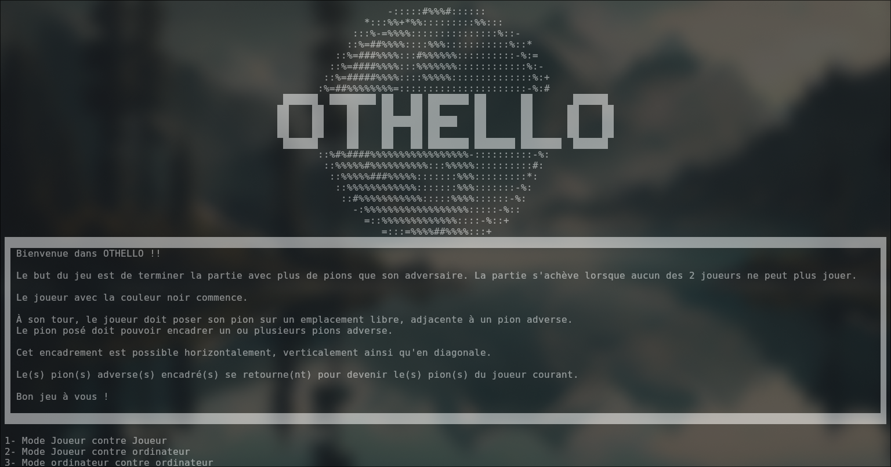
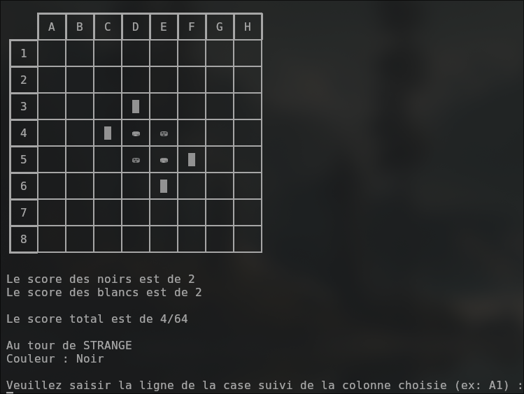

# Othello Agile

## Introduction

Ce projet est un jeu de Othello réalisé en Java. Il a été réalisé au début du 3ème semestre de BUT Informatique.
Durant ce projet, nous avons utilisé la méthode Agile pour la gestion de projet.

## Installation

Pour installer le projet, il suffit de cloner le projet sur votre machine.

```bash
git clone https://github.com/Strange500/Othello-agile.git
```

## Utilisation

Pour lancer le jeu, il suffit de lancer le fichier `Main.java` situé dans le dossier `src`.

## Captures d'écran





## Auteurs

- Benjamin Roget
- Cristobal Pinto 
- Florian Gambirasio 
- Hadrien Milo 
- Thomas Guislin 
- Tom Dequesnes 